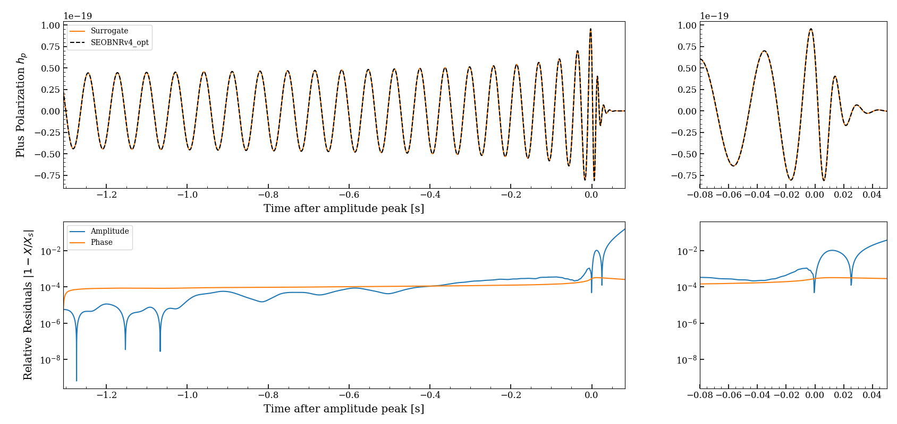

# GW Surrogate modeling: Bypassing slow gravitational wave simulators using machine learning

## What are surrogate models in gravitational wave astronomy?

For gravitational wave astronomy to be studied experimentally we (often) require prior knowledge of the expected signal. This is formally done by solving the Einstein field tensor equations for a black hole binary system in a process known as 'Numerical Relativity'. Unfortunately, NR is computationally expensive and thus prohibits efficient parameter estimation (which requires hundreds of thousands unique simulation results) in the event of an observation. Whilst physically motivated analytical methods exist, they are only restricted, case-by-case approximations. An alternative implementation seeks to utilize machine learning techniques to bypass simulators in a data-driven way. This is known as a 'Surrogate Model', which after being trained can be evaluated at the speed of a few milliseconds, offering extreme speedups up to millions of times.

## Predicting waveforms

This repository contains code in python (`pySurrogate.py` and `main.ipynb`) that aims to provide a simple interface for the creation of surrogate models for gravitational wave simulators. It was used to train a surrogate model for the generation of time-domain waveforms produced by the SEOBNRv4_opt (in substitute of an NR simulator). The black hole mergers are generated as spinning with $s^{1,2}_z \in [-0.8, 0.8]$ and with mass ratios $q \in [5, 100]$, while their waveforms are only considered from the ring-down phase and up to a few dozens of cycles before coalescence.

 